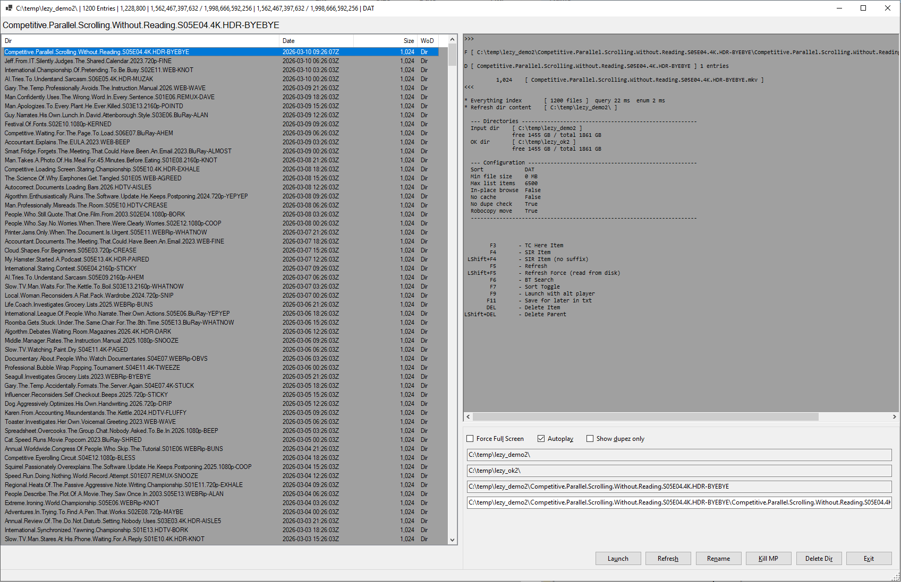

# LezyFileBrowser

A fast, keyboard-driven Windows file manager for reviewing downloaded content (torrents, Usenet). Built with C# / WinForms on .NET 10.0 — no external dependencies.

## Screenshot



## What it does

You point it at a download directory. It lists everything above a configurable size threshold, lets you quickly play/save/delete items with single keystrokes, detects duplicate files and similar-named releases, and moves accepted files to a destination directory — optionally via robocopy for large transfers.

## Requirements

- Windows 10/11
- [.NET 10.0 Runtime](https://dotnet.microsoft.com/download/dotnet/10.0) (Desktop Runtime for WinForms)
- Optional: [Everything](https://www.voidtools.com/) + [Everything SDK](https://www.voidtools.com/support/everything/sdk/) (for fast directory scanning via `Everything64.dll`)
- Optional: MPlayer / MPC-HC / SMPlayer for media playback

## Configuration

All settings live in `App.config` and can be overridden with environment variables (`X_*` prefix). The two required settings:

| Variable | Description |
|---|---|
| `X_INPUT_DIR` | Directory to browse (your downloads folder) |
| `X_OK_DIR` | Destination for accepted items |

Common optional settings:

| Variable | Default | Description |
|---|---|---|
| `X_MIN_FILE_SIZE_MB` | `99` | Hide files smaller than this |
| `X_SORT_DIR` | `1` | Sort order: `1`=date desc, `3`=name asc, `7`=random |
| `X_INPLACE_BROWSING` | `false` | Source equals destination (local re-org mode) |
| `X_MOVE_WITH_ROBOCOPY` | `true` | Use robocopy instead of `Directory.Move` |
| `X_MAX_LIST_ITEMS` | unlimited | Cap the list to N entries |
| `X_NO_CACHE` | `false` | Skip the in-memory cache on every refresh |
| `X_NO_DUPE_CHECK` | `false` | Disable all duplicate and similar-name detection (skips coloring and dupe-check passes) |
| `PLAYER_PROCESS_NAMES` | `mplayer,mpc-hc64,smplayer` | Processes to track for focus management |
| `VIDEO_EXTENSIONS` | `.mkv,.mp4,.avi,...` | Extensions treated as video |
| `DUPE_CHECK_HEAD_MB` | `10` | Bytes compared at file start for duplicate detection |
| `DUPE_CHECK_TAIL_MB` | `10` | Bytes compared at file end for duplicate detection |
| `SIMILAR_NAME_MIN_TOKENS` | `5` | Minimum shared leading dot-tokens to flag as similar |

## Keyboard shortcuts

| Key | Action |
|---|---|
| `Enter` | Launch selected item in media player |
| `Space` | Save — move to OK dir |
| `Del` | Soft-delete (60-second undo window) |
| `Shift+Del` | Delete parent directory |
| `Ctrl+Z` | Undo pending soft-delete |
| `F3` | Open Total Commander here |
| `F4` / `Shift+F4` | SABnzbd / Usenet lookup |
| `F5` / `Shift+F5` | Refresh / force refresh (bypass cache) |
| `F6` | Search for selected item on torrent sites |
| `F7` | Cycle sort: date → name → random |
| `F9` | Launch with alternative player |
| `F11` | Save for later (append to a text file in Documents) |

## Duplicate and similar-name detection

The list highlights potential duplicates with colours:

| Colour | Meaning |
|---|---|
| Red | File already exists in the OK directory |
| Amber | Content-identical duplicate elsewhere in the input directory (same size + head/tail bytes) |
| Pale orange | Similar name — shares enough leading dot-separated tokens to be the same show/release |

Selecting any highlighted item logs all its peers in the side panel. The **Show dupez only** checkbox filters the list to flagged items only.

When you delete a duplicate, all content-identical peers are soft-deleted together (same 60-second undo). When you save one, any remaining duplicates in the input directory are hard-deleted immediately.

## Build

```
dotnet build LezyFileBrowserNet10.sln          # Debug
dotnet build LezyFileBrowserNet10.sln -c Release  # Release → c:\bin\toolz\
```

Or use the included `rebuild.cmd`.

To run the app against your own Downloads folder, copy and run `sample_launch.cmd`. It sets `X_INPUT_DIR` to `%USERPROFILE%\Downloads` and `X_OK_DIR` to `%USERPROFILE%\Downloads_ok` — edit those two lines to match your setup.

## Project structure

```
LezyFileBrowserNet10/
├── LezyFileBrowserNet10.sln
└── LezyFileBrowserNet10/
    ├── Program.cs              # Entry point, high-DPI setup
    ├── MainForm.cs             # Core UI logic and all keyboard handlers
    ├── FileOperations.cs       # Async move queue, robocopy wrapper, history
    ├── FileActions.cs          # Media player launch, window focus, WoD heuristic
    ├── DuplicateFinder.cs      # Duplicate + similar-name detection algorithms
    ├── EverythingSearch.cs     # Everything SDK integration (P/Invoke, optional)
    ├── Util.cs                 # Dangerous extensions, disk space queries
    ├── Caching.cs              # In-memory directory size cache
    ├── ListItemDir.cs          # ListItemTag data model
    ├── FileData.cs             # Lightweight file metadata (no extra I/O)
    └── App.config              # All settings with inline documentation
```

## License

MIT
